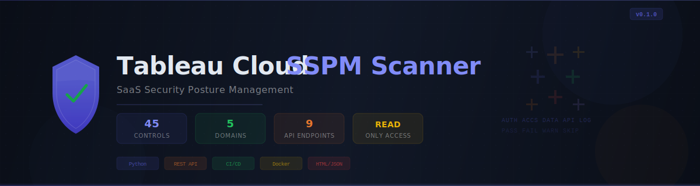

<p align="center">
  
</p>

<p align="center">
  <strong>SaaS Security Posture Management for Tableau Cloud</strong><br>
  <sub>30 security controls &middot; 5 domains &middot; severity-weighted scoring &middot; HTML &amp; JSON reports</sub>
</p>

<p align="center">
  
  
  
  
</p>

---

## Overview

The **Tableau Cloud SSPM Scanner** connects to a live Tableau Cloud instance via the REST API, collects configuration data (users, groups, projects, data sources, workbooks, flows, site settings), and evaluates **30 security controls** across 5 domains. It produces a severity-weighted posture score (0-100) and generates both JSON and HTML reports with actionable remediation guidance.

The scanner is **read-only** -- it never modifies your Tableau Cloud environment. Authentication uses a Personal Access Token (PAT) with the minimum required scope.

## Security Controls

### Identity & Authentication (AUTH-001 -- AUTH-006)

| Check ID | Control | Severity |
|----------|---------|----------|
| AUTH-001 | IdP Federation (SAML/OIDC) | CRITICAL |
| AUTH-002 | Stale Account Detection (>90 days) | HIGH |
| AUTH-003 | Site Administrator Count | HIGH |
| AUTH-004 | Unlicensed / Inactive Viewer Cleanup | LOW |
| AUTH-005 | Duplicate Admin Account Detection | MEDIUM |
| AUTH-006 | Authentication Method Consistency | MEDIUM |

### Access Control & Permissions (ACCS-001 -- ACCS-006)

| Check ID | Control | Severity |
|----------|---------|----------|
| ACCS-001 | Over-Privileged Creator Accounts | HIGH |
| ACCS-002 | Default Project Permissions | HIGH |
| ACCS-003 | Project Permission Locking | MEDIUM |
| ACCS-004 | Guest User Access | MEDIUM |
| ACCS-005 | Group-Based Access Control | MEDIUM |
| ACCS-006 | 'All Users' Group Permission Scope | HIGH |

### Data Security (DATA-001 -- DATA-006)

| Check ID | Control | Severity |
|----------|---------|----------|
| DATA-001 | Embedded Credentials Audit | CRITICAL |
| DATA-002 | Extract Encryption at Rest | HIGH |
| DATA-003 | Sensitive Data Source Naming | HIGH |
| DATA-004 | Data Source Certification Coverage | MEDIUM |
| DATA-005 | Data Download Surface Area | MEDIUM |
| DATA-006 | Stale Data Source Detection | MEDIUM |

### API & Integrations (API-001 -- API-006)

| Check ID | Control | Severity |
|----------|---------|----------|
| API-001 | Dashboard Extension Allowlist | HIGH |
| API-002 | Revision History for Change Tracking | MEDIUM |
| API-003 | Subscribe Others Control | MEDIUM |
| API-004 | Run Now Access Control | LOW |
| API-005 | Prep Flow Security Review | MEDIUM |
| API-006 | Content Sprawl Assessment | LOW |

### Logging & Monitoring (LOG-001 -- LOG-006)

| Check ID | Control | Severity |
|----------|---------|----------|
| LOG-001 | Tableau Catalog (Data Management) | HIGH |
| LOG-002 | User Visibility Controls | MEDIUM |
| LOG-003 | Commenting & Mention Controls | LOW |
| LOG-004 | Access Review Readiness | HIGH |
| LOG-005 | Orphaned Content Detection | MEDIUM |
| LOG-006 | Governed Access Request Workflow | LOW |

## Architecture

```
                       Tableau Cloud REST API
                              |
                              v
                   +---------------------+
                   |  Phase 1: Collect   |    collector.py
                   |  (9 API endpoints)  |    tableauserverclient SDK
                   +---------------------+
                              |
                              v
                   +---------------------+
                   |  Phase 2: Analyze   |    checks.py
                   |  (30 controls)      |    SecurityChecks class
                   +---------------------+
                              |
                              v
                   +---------------------+
                   |  Phase 3: Score     |    scoring.py + report.py
                   |  & Report           |    JSON + HTML output
                   +---------------------+
```

| Module | Lines | Purpose |
|--------|-------|---------|
| `collector.py` | 230 | REST API data ingestion via `tableauserverclient` SDK |
| `checks.py` | 852 | 30 security control evaluations |
| `models.py` | 68 | Shared dataclasses, enums, severity weights |
| `scoring.py` | 37 | Severity-weighted posture score calculation |
| `report.py` | 150 | JSON + dark-themed HTML report generation (Jinja2) |
| `cli.py` | 166 | CLI entrypoint with argparse + env var fallback |

## Prerequisites

1. **Python 3.10+**
2. **Tableau Cloud site** with admin access
3. **Personal Access Token (PAT)** -- create one in Tableau Cloud:
   - Go to **My Account Settings** > **Personal Access Tokens**
   - Create a token and save the **name** and **secret**
   - The PAT user must have the **Site Administrator Creator** role

## Installation

### From source

```bash
git clone https://github.com/Krishcalin/SSPM-Tableau.git
cd SSPM-Tableau
pip install -e .
```

### Development setup

```bash
pip install -e ".[dev]"
pre-commit install
```

### Docker

```bash
docker build -t tableau-sspm:latest .
```

## Usage

### CLI arguments

```bash
tableau-sspm \
  --server https://prod-apsoutheast-a.online.tableau.com \
  --site my-site \
  --token-name my-pat-name \
  --token-secret <YOUR_PAT_SECRET>
```

### Environment variables

```bash
export TABLEAU_SERVER=https://prod-apsoutheast-a.online.tableau.com
export TABLEAU_SITE=my-site
export TABLEAU_TOKEN_NAME=my-pat-name
export TABLEAU_TOKEN_SECRET=<YOUR_PAT_SECRET>

tableau-sspm
```

### Docker

```bash
docker run --rm \
  -e TABLEAU_SERVER \
  -e TABLEAU_SITE \
  -e TABLEAU_TOKEN_NAME \
  -e TABLEAU_TOKEN_SECRET \
  -v $(pwd)/sspm_output:/app/output \
  tableau-sspm:latest
```

### CLI options

| Flag | Default | Description |
|------|---------|-------------|
| `--server` | `$TABLEAU_SERVER` | Tableau Cloud pod URL |
| `--site` | `$TABLEAU_SITE` | Site content URL (from your Tableau URL path) |
| `--token-name` | `$TABLEAU_TOKEN_NAME` | PAT name |
| `--token-secret` | `$TABLEAU_TOKEN_SECRET` | PAT secret value |
| `--output-dir` | `./sspm_output` | Directory for report output |
| `--json-only` | `false` | Skip HTML report, output JSON only |
| `--min-score` | `0` | Minimum passing score (exit 1 if below) |

## Output

The scanner produces two report files in `--output-dir`:

- **`SSPM-YYYYMMDD-HHMMSS.json`** -- Machine-readable findings with full evidence
- **`SSPM-YYYYMMDD-HHMMSS.html`** -- Dark-themed visual report with posture score, per-category breakdown, findings, and remediation

### Console output

```
------------------------------------------------------------
  Tableau Cloud SSPM Scanner
  Scan ID: SSPM-20260313-143022
------------------------------------------------------------

> Phase 1: Data Collection
  |-- Connecting to https://prod-apsoutheast-a.online.tableau.com (site: my-site)
  |-- Authenticated successfully (API v3.21)
  |-- Collecting users...
  |   +-- 47 users found
  ...
  +-- Disconnected

> Phase 2: Security Assessment
  |-- Running identity checks...
  |-- Running access control checks...
  |-- Running data security checks...
  |-- Running API & integration checks...
  |-- Running logging & monitoring checks...
  +-- 30 checks completed

> Phase 3: Scoring & Reporting
  |-- JSON report: ./sspm_output/SSPM-20260313-143022.json
  |-- HTML report: ./sspm_output/SSPM-20260313-143022.html

------------------------------------------------------------
  POSTURE SCORE: 72 / 100
------------------------------------------------------------
  Passed:   18
  Failed:    5
  Warnings:  7
  Skipped:   0
------------------------------------------------------------
  Identity & Authentication: 65%
  Access Control & Permissions: 80%
  Data Security: 58%
  API & Integrations: 81%
  Logging & Monitoring: 75%
------------------------------------------------------------
```

### Exit codes

| Code | Meaning |
|------|---------|
| `0` | No critical failures and score above `--min-score` |
| `1` | CRITICAL-severity checks failed **or** score below `--min-score` |

## Scoring

The posture score (0--100) uses severity-weighted calculation:

| Severity | Weight | Description |
|----------|--------|-------------|
| CRITICAL | 25 | Direct breach or account-takeover risk |
| HIGH | 15 | Significant security gap |
| MEDIUM | 8 | Governance or configuration weakness |
| LOW | 3 | Best practice improvement |
| INFO | 0 | Informational (does not affect score) |

**How scoring works:**

- **PASS** = full weight earned
- **WARN** = 50% weight earned
- **FAIL** = 0% weight earned
- **SKIP** = excluded from calculation

**Score interpretation:**

| Range | Rating | Action |
|-------|--------|--------|
| 85--100 | Strong | Maintain current posture |
| 65--84 | Moderate | Address HIGH and CRITICAL findings |
| 40--64 | Weak | Significant gaps require remediation plan |
| 0--39 | Critical | Immediate remediation required |

## API Endpoints Used

The scanner queries 9 Tableau REST API resources (all **read-only**):

| Endpoint | Data Collected |
|----------|----------------|
| `GET /api/3.x/sites/{siteId}/users` | User accounts, roles, auth settings, last login |
| `GET /api/3.x/sites/{siteId}/groups` | Group membership and structure |
| `GET /api/3.x/sites/{siteId}/projects` | Project hierarchy and permission modes |
| `GET /api/3.x/sites/{siteId}/datasources` | Data source configurations and metadata |
| `GET /api/3.x/sites/{siteId}/datasources/{dsId}/connections` | Connection credentials and types |
| `GET /api/3.x/sites/{siteId}/workbooks` | Workbook inventory and ownership |
| `GET /api/3.x/sites/{siteId}/schedules` | Extract refresh schedules |
| `GET /api/3.x/sites/{siteId}/flows` | Prep flow inventory |
| `GET /api/3.x/sites/{siteId}` | Site-level settings and configuration |

No write operations are performed. The PAT user only needs read access.

## CI/CD Integration

### GitHub Actions

```yaml
name: Tableau SSPM Scan

on:
  schedule:
    - cron: '0 6 * * 1'  # Weekly Monday 06:00 UTC
  workflow_dispatch:
    inputs:
      min_score:
        description: 'Minimum passing score (0-100)'
        default: '0'

jobs:
  scan:
    runs-on: ubuntu-latest
    environment: tableau-cloud
    steps:
      - uses: actions/checkout@v4
      - uses: actions/setup-python@v5
        with:
          python-version: '3.12'
      - run: pip install -e .
      - name: Run SSPM Scan
        env:
          TABLEAU_SERVER: ${{ secrets.TABLEAU_SERVER }}
          TABLEAU_SITE: ${{ secrets.TABLEAU_SITE }}
          TABLEAU_TOKEN_NAME: ${{ secrets.TABLEAU_TOKEN_NAME }}
          TABLEAU_TOKEN_SECRET: ${{ secrets.TABLEAU_TOKEN_SECRET }}
        run: |
          tableau-sspm \
            --output-dir ./sspm-results \
            --min-score ${{ github.event.inputs.min_score || '0' }}
      - uses: actions/upload-artifact@v4
        if: always()
        with:
          name: sspm-report
          path: ./sspm-results/
          retention-days: 90
```

### Score gating

Use `--min-score` to fail the pipeline if the posture score drops below a threshold:

```bash
tableau-sspm --min-score 65 --output-dir ./results
```

## Development

### Make targets

```
make install       Install package
make dev           Install with dev deps + pre-commit hooks
make lint          Run ruff linter
make fmt           Auto-format code
make test          Run unit tests
make test-cov      Run tests with coverage report
make scan          Run SSPM scan (requires env vars)
make docker-build  Build Docker image
make docker-scan   Run scan via Docker
make clean         Remove build artifacts
```

### Running tests

```bash
make test           # Unit tests only
make test-cov       # With coverage report
```

Tests use pytest with markers:
- `@pytest.mark.unit` -- Fast tests, no API calls required
- `@pytest.mark.integration` -- Requires live Tableau API access

### Adding a new check

1. Add a method to `SecurityChecks` in `src/tableau_sspm/checks.py`:

```python
def _check_my_new_control(self):
    data = self.data.get("users", [])
    # ... evaluation logic ...
    self._add(
        check_id="DOMAIN-NNN",
        name="Human-Readable Name",
        category=Category.IDENTITY,  # IDENTITY, ACCESS, DATA, API, LOGGING
        severity=Severity.HIGH,
        status=Status.FAIL,          # PASS, FAIL, WARN, SKIP
        details="What was found",
        description="Why this matters",
        remediation="How to fix it",
        evidence=["item1", "item2"],
    )
```

2. Call it from `run_all()`
3. Add unit tests in `tests/test_checks.py`
4. Run `make lint && make test`

### Check ID conventions

| Domain | Prefix | Example |
|--------|--------|---------|
| Identity & Authentication | `AUTH-` | AUTH-001 |
| Access Control & Permissions | `ACCS-` | ACCS-003 |
| Data Security | `DATA-` | DATA-001 |
| API & Integrations | `API-` | API-002 |
| Logging & Monitoring | `LOG-` | LOG-004 |

### Project structure

```
SSPM-Tableau/
|-- src/
|   +-- tableau_sspm/
|       |-- __init__.py
|       |-- checks.py        # 30 security control evaluations
|       |-- cli.py            # CLI entrypoint
|       |-- collector.py      # REST API data collector
|       |-- models.py         # Dataclasses, enums, constants
|       |-- report.py         # JSON + HTML report generation
|       +-- scoring.py        # Severity-weighted scoring
|-- tests/
|   |-- conftest.py           # Test fixtures and mock data
|   |-- test_checks.py        # Security check unit tests
|   +-- test_scoring.py       # Scoring algorithm tests
|-- .github/workflows/
|   |-- ci.yml                # Lint + test + security scan
|   +-- scan.yml              # Scheduled SSPM scans
|-- .env.example              # Environment variable template
|-- Dockerfile                # Container image (non-root)
|-- Makefile                  # Development task automation
|-- pyproject.toml            # Package config + tool settings
+-- requirements.txt          # Production dependencies
```

## Security

- **Never commit `.env` files** or PAT secrets to version control
- Use environment variables or CI/CD secret stores for credentials
- Rotate Personal Access Tokens regularly
- Restrict PAT scope to read-only Site Administrator
- Review scan output before sharing -- it may contain user names and resource details

See [SECURITY.md](SECURITY.md) for vulnerability reporting.

## License

[MIT](LICENSE)
